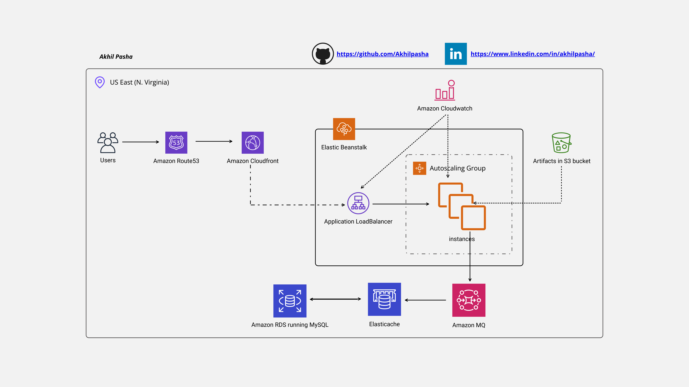
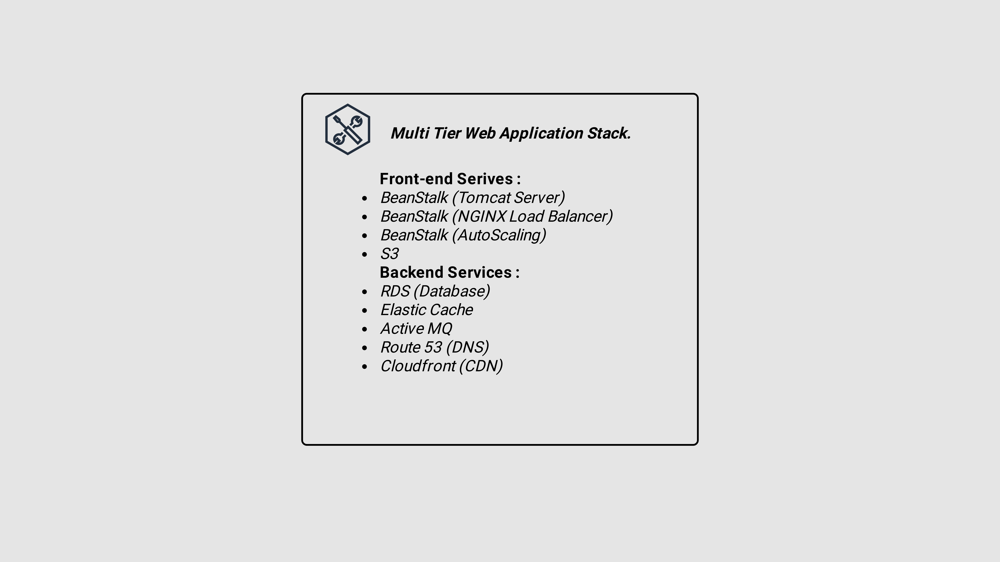

# vProfile_Project
Hosting a Multitier Web-Application using AWS Services like Cloudfront, RDS, S3 and more.  

## Architecture

**Services Used**:

- S3
- RDS
- AWS Cloudfront
- AWS Beanstalk
- MySQL
- GitHub Actions
- Route53
- Active MQ
- Amazon ElastiCache

## Go Live for this website

## Done by
- LinkedIn:[AkhilPasha](https://www.linkedin.com/in/akhilpasha/)
- Gmail: [akhilpasha704@gmail.com]
